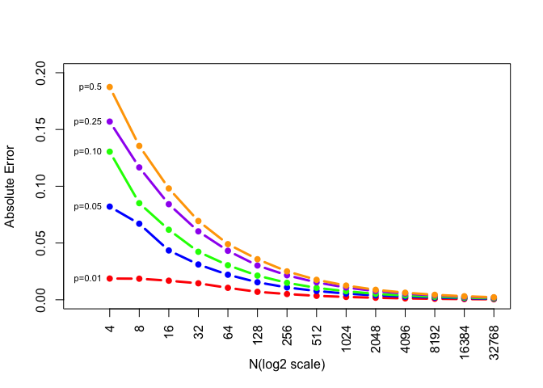
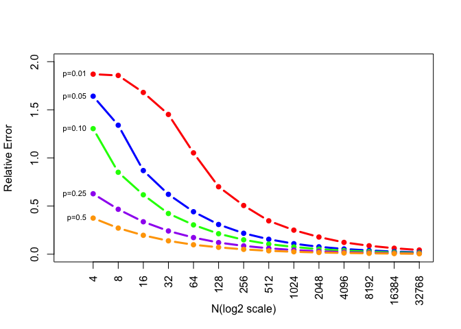
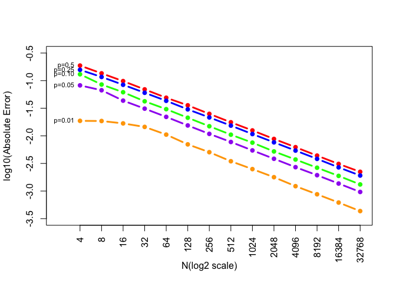
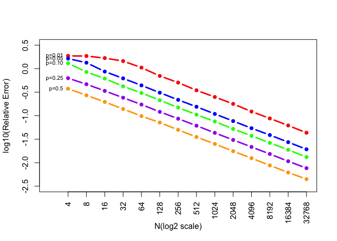

Simulation generates approximate answers and there is some degree of
error in a quantity estimated by Monte Carlo simulation. In this blog,
we are going to investigate the relationship between then number of
replicates and simulation error.

##<font color="darkgrey"> Definition </font>
------------------------------------------

*p̂*:the probability estimated from simulation

p: the true underlying probability

absolute error = \|*p̂* − *p*\|

relative error = \|*p̂* − *p*\|/*p*

## <font color="darkgrey">14 X 5 Factorial Experiment Simulation</font>
--------------------------------------------------------------------

replicate number: (2<sup>2</sup>, 2<sup>3</sup>, …, 2<sup>15</sup>)

probability: (0.01, 0.05, 0.10, 0.25, 0.50)

We first generate matrix for each combination of replicate number and
probability, then perform a 14 X 5 factorial experiment simulation

``` r
#generate matrix for each combination of replicate number and probability
abs_error=matrix(NA,14,5)
rel_error=matrix(NA,14,5)
p=c(0.01, 0.05, 0.10, 0.25, 0.50)
#perform a 14 X 5 factorial experiment simulation
for (i in 1:14){
  for (j in 1:5){
    p_hat=rbinom(10000,2^(i+1),p[j])/(2^(i+1))
    abs_error[i,j]=mean(abs(p_hat-p[j]))
    rel_error[i,j]=mean(abs(p_hat-p[j])/p[j])
  }
}
```

## <font color="darkgrey"> Figure: Absolute Error </font>
------------------------------------------------------

``` r
x_axis=c("4","8","16","32","64","128","256","512","1024","2048","4096","8192","16384","32768")
prob=c("0.01","0.05","0.10","0.25","0.5")
prob_label=paste0("p=",prob)
plot(as.vector(abs_error[,1]),xaxt='n',type="b",col="red",lwd=3,pch=20,xlim=c(0,14),ylim=c(0,0.2),xlab="N(log2 scale)",ylab="Absolute Error")
axis(1,at=1:14,labels=x_axis,las=2)
lines(as.vector(abs_error[,2]),type="b",col="blue",lwd=3,pch=20)
lines(as.vector(abs_error[,3]),type="b",col="green",lwd=3,pch=20)
lines(as.vector(abs_error[,4]),type="b",col="purple",lwd=3,pch=20)
lines(as.vector(abs_error[,5]),type="b",col="orange",lwd=3,pch=20)
text(1,abs_error[1,],prob_label,pos=2,cex=0.7)
```



The absolute error declines a lot when N is between 4 and 64 and stays
very samll after N exceeds 8192.

The degree of absolute error gets smaller as the number of simulation
replicates increases.

For p=0.01, its original absolute error’s value is the smallest among
five probabilities.

## <font color="darkgrey"> Figure: Relative Error </font>
------------------------------------------------------

``` r
x_axis=c("4","8","16","32","64","128","256","512","1024","2048","4096","8192","16384","32768")
prob=c("0.01","0.05","0.10","0.25","0.5")
prob_label=paste0("p=",prob)
plot(as.vector(rel_error[,1]),xaxt='n',type="b",col="red",lwd=3,pch=20,xlim=c(0,14),ylim=c(0,2),xlab="N(log2 scale)",ylab="Relative Error")
axis(1,at=1:14,labels=x_axis,las=2)
lines(as.vector(rel_error[,2]),type="b",col="blue",lwd=3,pch=20)
lines(as.vector(rel_error[,3]),type="b",col="green",lwd=3,pch=20)
lines(as.vector(rel_error[,4]),type="b",col="purple",lwd=3,pch=20)
lines(as.vector(rel_error[,5]),type="b",col="orange",lwd=3,pch=20)
text(1,rel_error[1,],prob_label,pos=2,cex=0.7)
```



The reletive error declines a lot when N is between 4 and 64 and stays
very samll after N exceeds 8192.

The degree of relative error gets smaller as the number of simulation
replicates increases.

For p=0.5, its original relative error’s value is the smallest among
five probabilities.

## <font color="darkgrey"> Figure: Absolute Error (with the y-axis is on the log10 scale) </font>
----------------------------------------------------------------------------------------------

Now let’s take log10 for absolute error and generate a new plot

``` r
x_axis=c("4","8","16","32","64","128","256","512","1024","2048","4096","8192","16384","32768")
prob=c("0.01","0.05","0.10","0.25","0.5")
prob_label=paste0("p=",prob)
plot(log10(as.vector(abs_error[,5])),xaxt='n',type="b",col="red",lwd=3,pch=20,xlim=c(0,14),ylim=c(-3.5,-0.5),xlab="N(log2 scale)",ylab="log10(Absolute Error)")
axis(1,at=1:14,labels=x_axis,las=2)
lines(log10(as.vector(abs_error[,4])),type="b",col="blue",lwd=3,pch=20)
lines(log10(as.vector(abs_error[,3])),type="b",col="green",lwd=3,pch=20)
lines(log10(as.vector(abs_error[,2])),type="b",col="purple",lwd=3,pch=20)
lines(log10(as.vector(abs_error[,1])),type="b",col="orange",lwd=3,pch=20)
text(1,log10(abs_error[1,]),prob_label,pos=2,cex=0.7)
```



We can see that it seems to be a linear relationship between
log10(absolute error) and N(log2 scale).

## <font color="darkgrey"> Figure: Relative Error (with the y-axis is on the log10 scale) </font>
----------------------------------------------------------------------------------------------

Let’s also take log10 for relative error and generate a new plot

``` r
x_axis=c("4","8","16","32","64","128","256","512","1024","2048","4096","8192","16384","32768")
prob=c("0.01","0.05","0.10","0.25","0.5")
prob_label=paste0("p=",prob)
plot(log10(as.vector(rel_error[,1])),xaxt='n',type="b",col="red",lwd=3,pch=20,xlim=c(0,14),ylim=c(-2.5,0.5),xlab="N(log2 scale)",ylab="log10(Relative Error)")
axis(1,at=1:14,labels=x_axis,las=2)
lines(log10(as.vector(rel_error[,2])),type="b",col="blue",lwd=3,pch=20)
lines(log10(as.vector(rel_error[,3])),type="b",col="green",lwd=3,pch=20)
lines(log10(as.vector(rel_error[,4])),type="b",col="purple",lwd=3,pch=20)
lines(log10(as.vector(rel_error[,5])),type="b",col="orange",lwd=3,pch=20)
text(1,log10(rel_error[1,]),prob_label,pos=2,cex=0.7)
```



We can see that it also seems to be a linear relationship between
log10(relative error) and N(log2 scale).

## <font color="darkgrey"> Conclusion </font>
------------------------------------------

From the four graphs, we can see that our intuition is right. That is,
the degree of error gets smaller as the number of simulation replicates
increases.

And for log 10 scale, the figures of the absolute error and relative
error shows that there is a linear relationship between absolute
error/relative error(log10 scale) and N(log2 sacale).

For p=0.01, its original absolute error’s value is the smallest among
five probabilities.

For p=0.5, its original relative error’s value is the smallest among
five probabilities.
